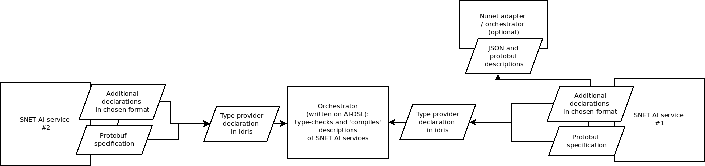

## memo 2021/02/14

(kabir)

The goal is to start building base ontology of data types and AI task types. However I had to read at least a bit about Idris and type dependencies right away just in order to understand what I am thinking about. This is still at a very rudimentary level, therefore contains mistakes and omissions.

Conceptually (from my understanding of writings and documents until now), the AI-DSL and ontology has to comply to at least these high level requirements:

1. *Extendable*: the ontology data types and AI task types should be extendable in the sense that individual service providers / users should be able to extend existing ontologies, create new types and tasks and make them available to the network. AI-DSL should be able to ingest these new types / tasks and immediately be able to do the type-checking job; The ontology of types / tasks has to be able to evolve.

2. *Completing versions*: extend-ability will require for the system to be able to sustain multiple versions of ontology and possibly competing types and task descriptions; AI-DSL should be able to handle them within the same mechanism and without requirement for some sort of global updates -- in other words it should be "logically decentralized";

3. *Language agnostic*, at least to some extent. I think it is important that the ontology is readable / writable by different components of the SNet platform, at least AI-DSL engine itself and each SNET service separately; This is needed because some of the required descriptors of an AI service will have to be dynamically calculated at the time of calling a service and will depend on the immediate context (e.g. price of service, a machine on which it is running, possibly reputation score, etc.).

Based on these requirements I am thinking about the ontology development more in terms of a platform / mechanism for extendable data structures + first versions to bootstrap it rather than developing a full ontology for covering the open world of AI tasks and datatypes, which is impossible anyway. It seems that Idris will allow to build all this, mostly thanks to Type Providers and possibly Foreign Function Interfaces. While Idris allows for type checking of all functions in a program (including the external ones via type providers, if they are written in Idris), most of SNET agents will be written in other languages and therefore opaque to Idris. If we think of SNET services as "foreign functions", then an orchestrator written in AI-DSL will do a job equivalent to 'type-checking' and 'compiling' a collection of these functions into one program / workflow (both are in quotes because there will be no way to formally check the correspondence of type declarations in Idris and actual functions within SNET services). Functionality of SNET agents is currently partially described internally (in terms of input and output) as protobuf files. We will have to (initially manually) translate them into Idris type declarations and make available to the network. (Btw, there is a way to translate protobuf specifications to Haskell types (via JSON), therefore maybe it can be adapted for automatic back and forth protobuf<->Idris translation in the future.) We also we may need to put additional information to these task descriptions, e.g. reputation score of a task or resource utilization constraints. In terms of resource constraints for AI services which are not written in Idris -- and therefore no formal verification will ever be possible on them -- resource utilization will most probably be estimated based on average historic usage (some sort of accumulated telemetry data with which we are dealing with NuNet). Furthermore, resource utilization constraints may need to be exposed to all kinds of external engines. E.g. for NuNet we are using Nomad job descriptions, which describe resource utilization of a service in a (kind of) JSON file -- machines on which containers are running are also described in the same way so that to match the amount of required resources for a service and available resources on a machine.

What I am thinking is some sort of framework of this kind:

In any case, I am thinking of experimenting with the above with the purpose of coming up with data structure / and possibly formats which then I will use to start describing data types and task types -- so that they can be used in first experiments and further extended as we go along. (P.S. one thing that I clearly do not have an idea how to go about are task descriptions of non-Idris AI services beyond type declarations of their inputs and outputs). 